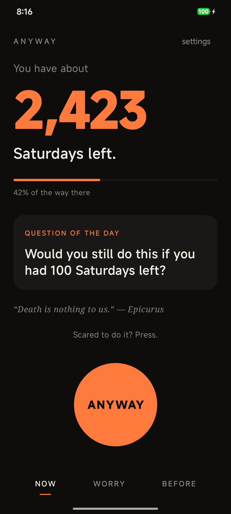
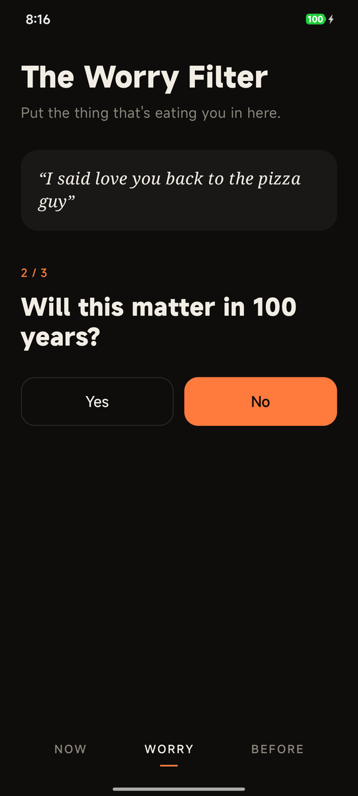
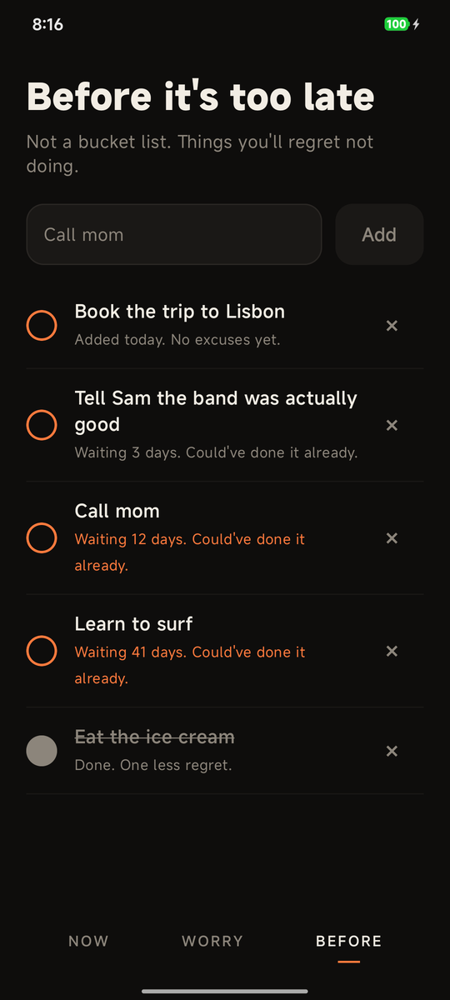
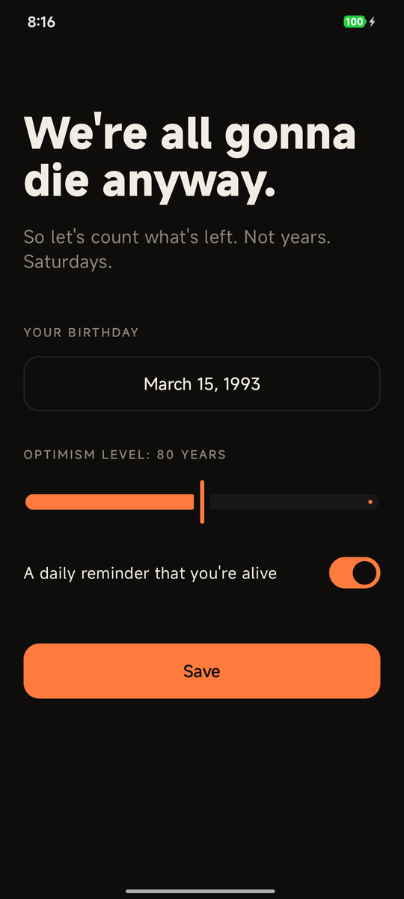
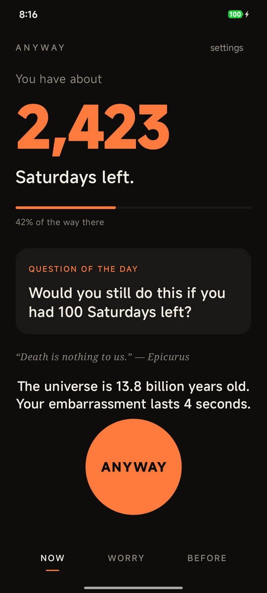
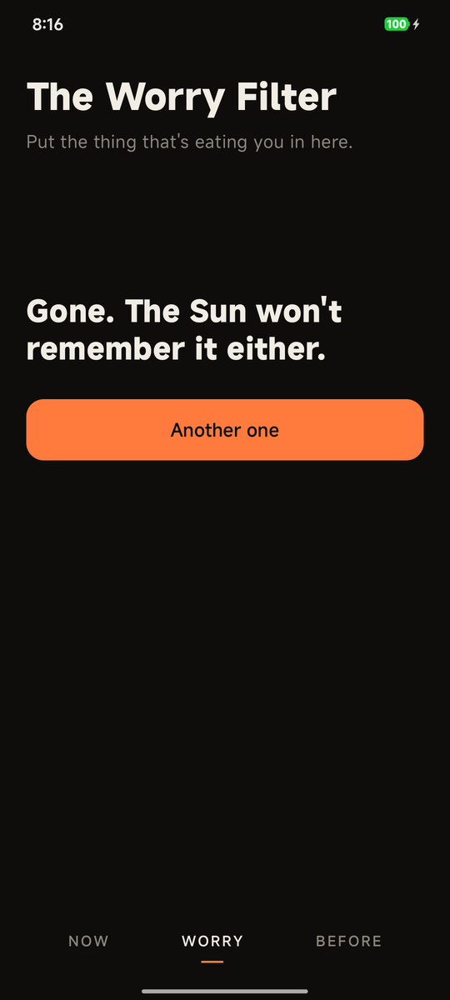

<div align="center">


# Anyway

**We're all gonna die anyway. So go do the thing.**

A small, slightly dark, surprisingly warm Android app about living *now* —
built on the old Stoic idea of *memento mori*, minus the skulls.

[](https://github.com/bigdevwhale/anyway/actions/workflows/android.yml)
[](https://github.com/bigdevwhale/anyway/releases/latest/download/anyway.apk)


**English** · [Русский](README.ru.md)

<br />





</div>

---

## Why

You don't have *years*. You have **Saturdays** — about 4,000 of them if you're lucky.
Anyway shows you that number, then helps you stop wasting them on things the Sun won't remember.

It isn't a productivity app. It doesn't track streaks or nag you about goals.
It's the friend who read a lot of Seneca and now just wants you to text them back.

## What's inside

### ⏳ Now
A huge number: **how many Saturdays you have left**, counted from your birthday and an "optimism level" (life expectancy) you choose. Below it — a progress bar of the way so far, a **question of the day**, and a line from Marcus Aurelius, Seneca, Epicurus or Ecclesiastes.

And the big orange **ANYWAY** button. Scared to send the message, quit the job, dance badly? Press it.

### 🌀 The Worry Filter
Type what's eating you. Answer three questions:

1. Will this matter in **5 years**?
2. Will this matter in **100 years**?
3. Will this matter when **the Sun becomes a red giant**?

If it doesn't survive the filter, it shrinks, spins and floats away. If it does — it's real, and one tap puts it on your list.

### ✅ Before it's too late
Not a bucket list. Things you'll regret *not* doing — call mom, say it out loud, eat the ice cream. Every item quietly counts how long it's been waiting. After a week, it turns orange.

### 🔔 You're still alive
Once a day, at a random moment between 10:00 and 21:00, a notification reminds you that you're alive — and asks what you'll do about it.

<div align="center">





</div>

## Install

Grab the APK from the **[latest release](https://github.com/bigdevwhale/anyway/releases/latest)** (or the [direct link](https://github.com/bigdevwhale/anyway/releases/latest/download/anyway.apk)) and open it on your phone. Android 8.0+.

## Privacy

Anyway has **no internet permission**. Your birthday, your worries and your list never leave the device. No accounts, no analytics, no ads.

## Languages

English and Russian. Pick one on the first screen or later in *settings* — or leave it on *System*. On Android 13+ the choice is shared with *Settings → Apps → Anyway → Language*.

## Build

Requirements: JDK 17+ and the Android SDK (API 36).

```bash
./gradlew assembleDebug     # app/build/outputs/apk/debug/app-debug.apk
./gradlew installDebug      # straight to a connected device
```

### CI/CD

[`.github/workflows/android.yml`](.github/workflows/android.yml) builds and lints a minified release APK on every push and pull request and uploads it as a workflow artifact. Pushing a `v*` tag publishes a GitHub Release with the APK attached:

```bash
git tag v0.2.0 && git push origin v0.2.0
```

## Under the hood

- **Kotlin + Jetpack Compose**, Material 3, single activity, zero third-party dependencies
- `SharedPreferences` for the little state there is
- `AlarmManager` + `BroadcastReceiver` for the daily nudge, rescheduled after reboot
- Always-dark palette: ink `#0E0D0C`, ember `#FF7A3D`, bone `#F2EDE4`

```
app/src/main/java/io/cyberdise/anyway/
├── MainActivity.kt
├── Life.kt          # Saturdays-left math
├── Store.kt         # persistence + Compose state
├── Nudges.kt        # daily notification + receivers
└── ui/              # Now, Worry, Before, Setup screens + theme
```

---

<div align="center">
<sub><i>Memento mori. Now go outside.</i></sub>
</div>
