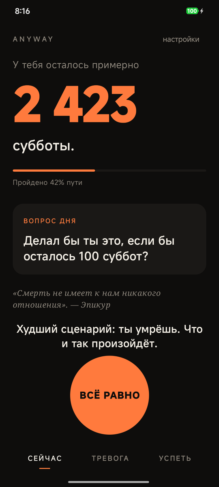
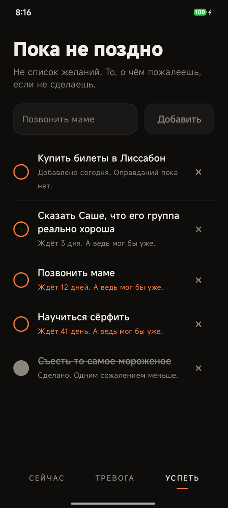
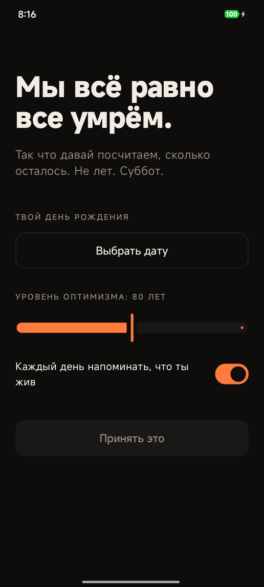

<div align="center">


# Anyway

**Мы всё равно все умрём. Так что иди и сделай это.**

Маленькое, немного мрачное и неожиданно тёплое Android-приложение о жизни *сейчас* —
по мотивам стоического *memento mori*, только без черепов.

[](https://github.com/bigdevwhale/anyway/actions/workflows/android.yml)
[](https://github.com/bigdevwhale/anyway/releases/latest/download/anyway.apk)


[English](README.md) · **Русский**

<br />





</div>

---

## Зачем

У тебя нет *лет*. У тебя есть **субботы** — если повезёт, около 4 000.
Anyway показывает это число и помогает не тратить их на то, о чём Солнце даже не вспомнит.

Это не приложение для продуктивности. Никаких стриков и напоминаний о целях.
Это друг, который много читал Сенеку и теперь просто хочет, чтобы ты ответил ему на сообщение.

## Что внутри

### ⏳ Сейчас
Огромная цифра — **сколько суббот у тебя осталось**. Считается от дня рождения и «уровня оптимизма» (ожидаемой продолжительности жизни), который ты выбираешь сам. Под ней — сколько пути уже пройдено, **вопрос дня** и строчка из Марка Аврелия, Сенеки, Эпикура или Екклесиаста.

И большая оранжевая кнопка **ВСЁ РАВНО**. Страшно написать первым, уволиться, станцевать? Жми.

### 🌀 Переживатор
Напиши, что тебя грызёт, и ответь на три вопроса:

1. Будет ли это важно через **5 лет**?
2. Будет ли это важно через **100 лет**?
3. Будет ли это важно, когда **Солнце станет красным гигантом**?

Если тревога не прошла фильтр — она сжимается, крутится и улетает. Если прошла — значит, это реально, и одним нажатием она попадает в твой список.

### ✅ Пока не поздно
Не список желаний. То, о чём пожалеешь, если *не* сделаешь: позвонить маме, сказать это вслух, съесть то самое мороженое. Каждый пункт тихо считает, сколько дней он ждёт. Через неделю — становится оранжевым.

### 🔔 Ты всё ещё жив
Раз в день, в случайный момент между 10:00 и 21:00, приходит уведомление: ты жив. Что сделаешь с этим?

## Установка

Скачай APK из **[последнего релиза](https://github.com/bigdevwhale/anyway/releases/latest)** (или по [прямой ссылке](https://github.com/bigdevwhale/anyway/releases/latest/download/anyway.apk)) и открой на телефоне. Нужен Android 8.0+.

## Приватность

У Anyway **нет доступа в интернет**. День рождения, тревоги и список никогда не покидают устройство. Никаких аккаунтов, аналитики и рекламы.

## Языки

Русский и английский. Язык выбирается на первом экране или потом в *настройках* — либо остаётся *системным*. На Android 13+ выбор синхронизирован с *Настройки → Приложения → Anyway → Язык*.

## Сборка

Нужны JDK 17+ и Android SDK (API 36).

```bash
./gradlew assembleDebug     # app/build/outputs/apk/debug/app-debug.apk
./gradlew installDebug      # сразу на подключённое устройство
```

### CI/CD

[`.github/workflows/android.yml`](.github/workflows/android.yml) на каждый push и pull request собирает минифицированный release-APK, прогоняет lint и выкладывает APK в артефакты. Push тега `v*` публикует GitHub Release с приложенным APK:

```bash
git tag v0.2.0 && git push origin v0.2.0
```

## Как устроено

- **Kotlin + Jetpack Compose**, Material 3, одна activity, ноль сторонних зависимостей
- `SharedPreferences` для того немногого, что нужно хранить
- `AlarmManager` + `BroadcastReceiver` для ежедневного напоминания, восстанавливается после перезагрузки
- Всегда тёмная палитра: чернила `#0E0D0C`, закат `#FF7A3D`, кость `#F2EDE4`

---

<div align="center">
<sub><i>Memento mori. А теперь иди погуляй.</i></sub>
</div>
